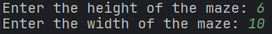

# Mazes

# How to use?

## Launching the project

Launching the project (class`Main`,  method `main`)

## Selecting the size of the maze

We enter the height and width of the maze - integers, added a constraint that they must be greater than two, so that on each side there are at least three options for entering or exiting the maze

In case of incorrect input, we will see the corresponding message and will repeat the input until it becomes correct.

## Selecting a maze generation algorithm

Now we select a maze generation algorithm: Prim algorithm or Kruskal algorithm or one of them, chosen randomly

## Selecting a rendering method

Now we choose the rendering method: PlusMinus, built on the symbols `+` , `-` и `|` , or Colorful, built on multicolored squares

Note: using the PlusMinus method, I can fit a maze with a width of 47 and a height of 14; using the Colorful method, I can fit a maze with a width of 30 and a height of 14.

Another note: when rendering Colorful it looks like the maze is twice as big as requested, but it's not. It's just that all the passages and lack of passages have to be drawn as a separate symbol.

## Selecting the start and end of the maze

Now we choose the beginning and the end of the maze. In order not to get confused and not to make a mistake with the cardinal directions, a “compass” is depicted to the right of the options.

In this example, we chose the start in the upper left corner and the end in the lower right, we get

The letter `A`  marks the beginning of the maze, the letter `B`  marks the end.

## Selecting a labyrinth solving algorithm

Now we choose the algorithm for solving the maze: `BFS` or `Dijkstra` or one of them chosen at random

And we get

Under the legend we see statistics - the number of good and bad passes completed

# What's going on inside?

1. Get the height of the maze
2. Get the width of the maze
3. Get the maze generator type
4. Get the maze renderer type
5. Generate the maze
6. Fill the maze cells
7. Print the finished maze
8. Wait for the user's reaction
9. Get the coordinates of the start and end of the maze
10. Print the maze with the start and end
11. Wait for the user's reaction
12. Get the maze solver type
13. Solve the maze
14. Calculate the statistics for the solution
15. Print the maze with the solution and the statistics

# Classes

## 🗀 Entities

### Cell

Table cell. Contains the row number, column number and cell type

### Coordinate

Class coordinates on a two-dimensional plane. Contains the row and column number

### Edge

Edge class. Contains two coordinates - the start coordinate and the end coordinate

### Maze

Maze class. Contains the height and width of the maze, the cell matrix, and the adjacency matrix

## 🗀 Commons

### CoordinateIndexConverter

A class that encapsulates the logic of converting the `Coordinate` class to the `int` class and back according to the following principle: a two-dimensional array is “straightened” and the index of the element in the resulting linear array is taken. The opposite is similar

### DirectionCoordinateConverter

A class encapsulating the logic of converting `Direction` into a `Coordinate` class according to the following principle: if the direction is “straight” (for example, `NORTH`), then you need to take the cell in the middle of the corresponding side, otherwise take the corresponding angle

### ParentsPathConverter

A class that encapsulates the logic of converting a list of indices into a list of coordinates according to the following principle: in the list of parent indices, we find from which index we came to the exit of the maze and write down the corresponding coordinate. We repeat recursively until we reach the beginning of the labyrinth

### Interface Randomizable<T>

An interface that corresponds to classes that have an element of randomness in them

### EnumRandomPicker

A class that encapsulates the logic for selecting a random enumeration value.

### Interface Printing

An interface that classes that must be able to print something to the `PrintStream`

### Interface Reading

An interface that classes that must be able to read something from `InputStream`

## 🗀 Generators

### Interface MazeGenerator

Interface of classes generating mazes

### AbstractMazeGenerator

Abstract class of maze generator, containing methods common to all generators

### PrimMazeGenerator

Class implementing maze generation using Prim algorithm

### KruskalMazeGenerator

Class implementing maze generation using Kruskal algorithm

## 🗀 Fillers

### Interface MazeFiller

Interface of classes that fill the maze, i.e. change the `CellType` of the maze cells

### RandomMazeFiller

Class that implements maze filling in the following way: for each cell, it is randomly selected whether it will be empty, good or bad

## 🗀 Renderers

### Interface MazeRenderer

Interface of classes that create a string representation of mazes

### ConsoleMazeRenderer

Class that implements the `MazeRenderer` interface, has a private constructor and static methods, instances with different parameters

## 🗀 Solvers

### Interface MazeSolver

Interface of classes that solve mazes

### BfsMazeSolver

Class implementing the `MazeSolver` interface, solving a maze using the `BFS` algorithm

### DijkstraMazeSolver

Class implementing the `MazeSolver` interface, solving a maze using the `Dijkstra` algorithm

## 🗀 Types

### CellType

Enumeration reflecting the content of the maze cells

### GeneratorType

Enumeration reflecting the available maze generation algorithms

### RendererType

Enumeration reflecting the available maze rendering methods

### SolverType

Enumeration reflecting the available maze solving algorithms

### Direction

Enumeration of 8 directions

## 🗀 Analyzers

### Interface PathStatistics

Interface implemented by classes of statistics that can be collected from solving the maze

### SimplePathStatistics

Class implementing the `PathStatistics` interface, counting the number of good and bad passes

### Interface MazePathAnalyzer

Interface implemented by classes that analyze the maze and its solution

### SimpleMazePathAnalyzer

Class implementing the `MazePathAnalyzer` interface, counting the `SimplePathStatistics` statistics

## 🗀 Readers

### Interface Reader

Interface implemented by classes that read data from the user

### ConsoleReader

Class that implements the `Reader` interface, reading data from the `InputStream` stream

## 🗀 Writers

### Interface Writer

An interface implemented by classes that write data to the user.

### ConsoleWriter

A class that implements the `Writer` interface, writing data to a `PrintStream`

## 🗀 Waiters

### Interface Waiter

Interface implemented by classes that allow waiting for user response

### ConsoleReader

Class implementing the `Writer` interface, allowing waiting for user response using the console

## 🗀 Receivers

### Interface Receiver

An interface implemented by classes that can receive data

### AbstractReceiver

An abstract class that has members common to all `Receivers`

### AbstractPickerReceiver

An abstract class that has members common to a narrower set of `Receivers`

### SizeReceiver

A class that implements the `Receiver` interface, receiving data about the size of the maze

### GeneratorReceiver

A class that implements the `Receiver` interface, receiving data about the maze generation method

### RendererReceiver

A class that implements the `Receiver` interface, receiving data about the maze rendering method

### CoordinateReceiver

A class that implements the `Receiver` interface, receiving data about the start and end of the maze

### SolverReceiver

A class that implements the interface `Receiver`, which receives data on how to solve the maze

## 🗀 Apps

### Interface App

Interface implemented by classes that are an application

### MazeApp

Class implementing the `App` interface and encapsulating the logic of our application

### MazeAppState

Class storing the current state of our application
