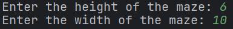
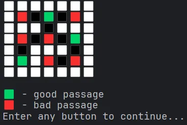

# Лабиринты

# Как пользоваться?

## Запускаем проект

Запускаем проект (класс `Main`, метод `main`)

## Выбор размеров лабиринта

Вводим высоту и ширину лабиринта - целые числа, добавил ограничение, что они должны быть больше двух, чтобы с каждой стороны было хотя бы три варианта для входа в лабиринт или выхода из него

В случае некорректного ввода, увидим соответствующее сообщение и будем повторять ввод, пока он не станет корректным

## Выбор алгоритма генерации лабиринта

Теперь выбираем алгоритм генерации лабиринта: алгоритм Прима, или алгоритм Крускала, или один из них, выбранный случайно

## Выбор способа рендеринга

Теперь выбираем способ рендеринга: PlusMinus, построенный на символах `+` , `-` и `|` , или Colorful, построенный на разноцветных квадратиках.

Замечание: способом PlusMinus у меня влезает лабиринт шириной 47 и высотой 14; способом Colorful - шириной 30 и высотой 14

Еще одно замечание: при рендеринге Colorful кажется, что лабиринт в 2 раза больше, чем просили, но это не так. Просто все проходы и отсутствие проходов приходится отрисовывать отдельным символом.

## Выбор начала и конца лабиринта

Теперь выбираем начало и конец лабиринта. Чтобы не запутаться и не ошибиться со сторонами света, справа от вариантов изображен “компас”

В данном примере выбрали начало в левом верхнем углу и конец в правом нижнем, получаем

Буквой `A`  отмечено начало лабиринта, буквой `B`  - конец.

## Выбор алгоритма решения лабиринта

Теперь выбираем алгоритм решения лабиринта: `BFS` или `Dijkstra` или один из них, выбранный случайно

И получаем

Под легендой видим статистику - количество пройденных хороших и плохих проходов

# Что происходит внутри

1. Получаем высоту лабиринта
2. Получаем ширину лабиринта
3. Получаем тип генератора лабиринта
4. Получаем тип рендерера лабиринта
5. Генерируем лабиринт
6. Наполняем клетки лабиринта
7. Печатаем готовый лабиринт
8. Ждем реакции пользователя
9. Получаем координаты начала и конца лабиринта
10. Печатаем лабиринт с началом и концом
11. Ждем реакции пользователя
12. Получаем тип решателя лабиринта
13. Решаем лабиринт
14. Считаем статистику по решению
15. Печатаем лабиринт с решением и статистику

# Классы

## 🗀 Entities

### Cell

Клетка таблицы. Содержит номер ряда, колонки и тип клетки

### Coordinate

Класс координаты на двумерной плоскости. Содержит номер ряда и колонки

### Edge

Класс ребра. Содержит две координаты - координату начала и координату конца

### Maze

Класс лабиринта. Содержит высоту и ширину лабиринта, матрицу клеток и матрицу смежности.

## 🗀 Commons

### CoordinateIndexConverter

Класс, инкапсулирующий логику конвертацию класса `Coordinate` в класс `int` и обратно по следующему принципу: двумерный массив “распрямляется” и берется индекс элемента в полученном линейном массиве. В обратную сторону аналогично

### DirectionCoordinateConverter

Класс, инкапсулирующий логику конвертацию `Direction` в класс `Coordinate` по следующему принципу: если направление “прямое” (например, `NORTH`), то надо взять клетку в середине соответствующей стороны, иначе взять соответсвующий угол

### ParentsPathConverter

Класс, инкапсулирующий логику конвертацию списка индексов в список координат по следующему принципу: в списке родительских индексов находим, из какого индекса пришли к выходу из лабиринта и записываем соответствующую координату. Повторяем рекурсивно, пока не дойдем до начала лабиринта

### Интерфейс Randomizable<T>

Интерфейс, которому соответствуют классы, имеющие в себе элемент случайности

### EnumRandomPicker

Класс, инкапсулирующий логику выбора случайного значения перечисления

### Интерфейс Printing

Интерфейс, которому соответствуют классы, которые должны уметь что-то печатать в `PrintStream`

### Интерфейс Reading

Интерфейс, которому соответствуют классы, которые должны уметь что-то читать из `InputStream`

## 🗀 Generators

### Интерфейс MazeGenerator

Интерфейс классов, генерирующих лабиринты

### AbstractMazeGenerator

Абстрактный класс генератора лабиринтов, содержащий в себе общие для всех генераторов методы

### PrimMazeGenerator

Класс, реализующий генерацию лабиринта по алгоритму Прима

### KruskalMazeGenerator

Класс, реализующий генерацию лабиринта по алгоритму Крускала

## 🗀 Fillers

### Интерфейс MazeFiller

Интерфейс классов, заполняющих лабиринт, т.е. меняющих `CellType` у клеток лабиринта.

### RandomMazeFiller

Класс, реализующий заполнение лабиринта следующим способом: для каждой клетки случайно выбирается, какой она будет - пустой, хорошей или плохой

## 🗀 Renderers

### Интерфейс MazeRenderer

Интерфейс классов, которые создают строковое представление лабиринтов

### ConsoleMazeRenderer

Класс, реализующий интерфейс `MazeRenderer`, имеющий приватный конструктор и статические методы, экземпляры с разными параметрами

## 🗀 Solvers

### Интерфейс MazeSolver

Интерфейс классов, которые решают лабиринты

### BfsMazeSolver

Класс, реализующий интерфейс `MazeSolver`, решающий лабиринт с помощью алгоритма `BFS`

### DijkstraMazeSolver

Класс, реализующий интерфейс `MazeSolver`, решающий лабиринт с помощью алгоритма `Dijkstra`

## 🗀 Types

### CellType

Перечисление, отражающее содержание клеток лабиринта

### GeneratorType

Перечисление, отражающее доступные алгоритмы генерации лабиринта

### RendererType

Перечисление, отражающее доступные способы рендеринга лабиринта

### SolverType

Перечисление, отражающее доступные алгоритмы решения лабиринта

### Direction

Перечисление 8 направлений

## 🗀 Analyzers

### Интерфейс PathStatistics

Интерфейс, который реализуют классы статистики, которую можно собрать по решению лабиринта

### SimplePathStatistics

Класс, реализующий интерфейс `PathStatistics`, считающий количество пройденных хороших и плохих проходов

### Интерфейс MazePathAnalyzer

Интерфейс, который реализуют классы, анализирующие лабиринт и его решение

### SimpleMazePathAnalyzer

Класс, реализующий интерфейс `MazePathAnalyzer`, считающий статистику `SimplePathStatistics`

## 🗀 Readers

### Интерфейс Reader

Интерфейс, который реализуют классы, читающие данные от пользователя

### ConsoleReader

Класс, реализующий интерфейс `Reader`, читая данные из потока `InputStream`

## 🗀 Writers

### Интерфейс Writer

Интерфейс, который реализуют классы, пишущие данные для пользователя

### ConsoleWriter

Класс, реализующий интерфейс `Writer`, записывая данные в поток `PrintStream`

## 🗀 Waiters

### Интерфейс Waiter

Интерфейс, который реализуют классы, позволяющие дождаться реакции пользователя

### ConsoleReader

Класс, реализующий интерфейс `Writer`, позволяющий дожидаться реакции пользователя с помощью консоли

## 🗀 Receivers

### Интерфейс Receiver

Интерфейс, который реализуют классы, имеющие возможность получать данные

### AbstractReceiver

Абстрактный класс, имеющий члены, общие для всех `Receiver`’ов

### AbstractPickerReceiver

Абстрактный класс, имеющий члены, общие для более узкого множества `Receiver`’ов

### SizeReceiver

Класс, реализующий интерфейс `Receiver`, получающий данные о размерах лабиринта

### GeneratorReceiver

Класс, реализующий интерфейс `Receiver`, получающий данные о способе генерации лабиринта

### RendererReceiver

Класс, реализующий интерфейс `Receiver`, получающий данные о способе рендеринга лабиринта

### CoordinateReceiver

Класс, реализующий интерфейс `Receiver`, получающий данные о начале и конце лабиринта

### SolverReceiver

Класс, реализующий интерфейс `Receiver`, получающий данные о способе решения лабиринта

## 🗀 Apps

### Интерфейс App

Интерфейс, который реализуют классы, являющиеся приложением

### MazeApp

Класс, реализующий интерфейс `App` и инкапсулирующий логику нашего приложения

### MazeAppState

Класс, хранящий текущее состояние нашего приложения
